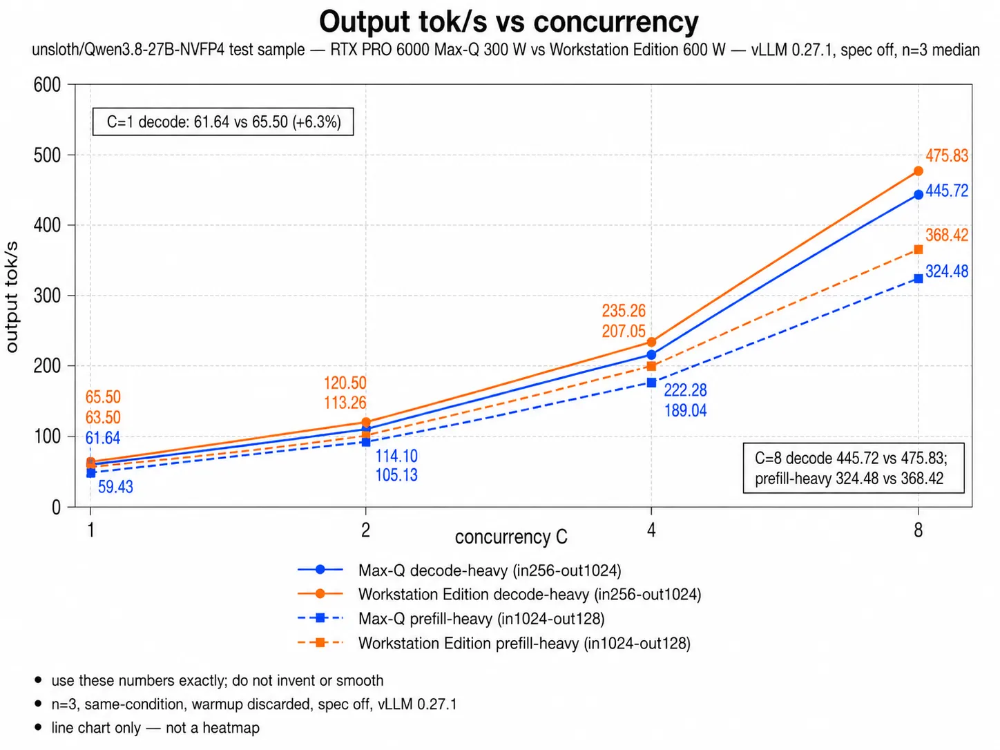
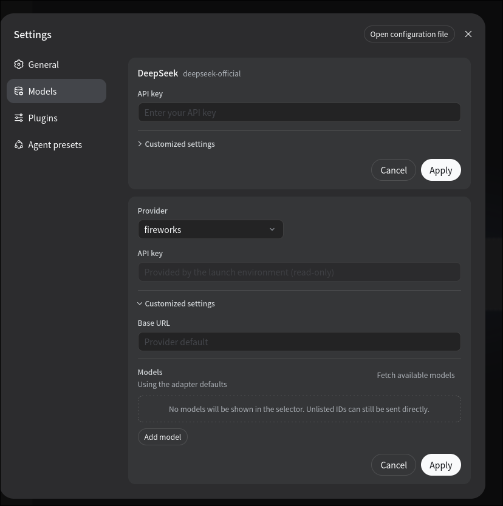
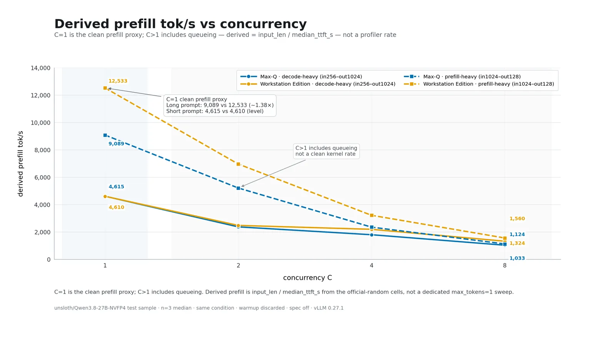
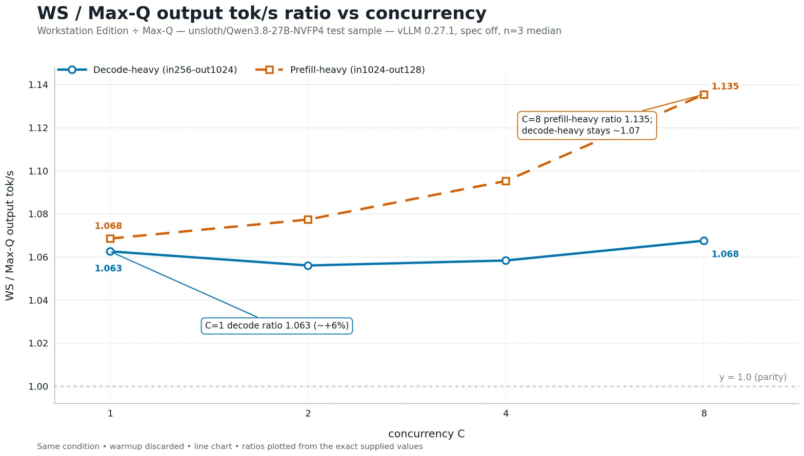

# RTX PRO 6000-MaxQ-vs-WorkStationEdition

Same-checkpoint, same-software, no-speculative-decoding comparison of **RTX PRO 6000 Blackwell Max-Q** vs **Workstation Edition**.

`unsloth/Qwen3.8-27B-NVFP4` served with **vLLM 0.27.1 / SM120** is the test workload, not the product. Numbers come from the official client `vllm bench serve`.

**These weights are Unsloth, not NVIDIA official Qwen3.8 NVFP4.** NVIDIA official NVFP4 for this model was unpublished at measurement time. Revision is pinned to `7d6f8d4d72f56b92b3cdbf22f156b90e1bab0108`.

## Why speculative decoding is off

Speculative-decoding accept length moves with the prompt and with sampling. That term is not a SKU property. Turning it off zeros the term so the comparison is bandwidth vs compute (300 W vs 600 W). Autoregressive-only reads the same weights the same number of times.

## Headline (n=3, same-condition)

Official `vllm bench serve` random, seed 0, temperature 0, request-rate inf, ignore-eos. Warmup `num_prompts=1` is discarded. Timed numbers are the n=3 median.

| metric | Max-Q | Workstation Edition | WS/Max-Q |
| --- | ---: | ---: | ---: |
| decode output tok/s (in=256, out=1024, C=1) | 61.64 | 65.50 | 1.063 |
| TTFT ms (same cell) | 55.5 | 55.5 | 1.00 |
| output tok/s (in=1024, out=128, C=1) | 59.43 | 63.50 | 1.069 |
| TTFT ms (same cell) | 112.6 | 81.7 | 0.73 |
| derived prefill tok/s (in=1024, C=1) | 9089 | 12533 | 1.38 |





## Prefill / latency





C=1 is the clean proxy; C>1 includes queueing.

`derived prefill` is `input_len / (median_ttft_s)`. TTFT includes the first decode token, so this is **derived, not a kernel measurement**. C>1 mixes queueing; see [`results/COMPARE.md`](results/COMPARE.md).

Decode-heavy C=1 TTFT is the same on both SKUs (≈ 55.5 ms). The gap is almost entirely decode rate (Max-Q 61.64 vs WS 65.50, **+6.3%**). Prefill-heavy C=1 splits on TTFT (Max-Q 112.6 ms vs WS 81.7 ms) and on derived prefill (9089 vs 12533).

Full C=1,2,4,8 matrices and Δ% are in [`results/COMPARE.md`](results/COMPARE.md).

WS-only single-stream chat (65.54 tok/s) has no Max-Q pair and is not part of the SKU table.

## Conditions (every number)

- Client: official `vllm bench serve` (`recipes/bench.sh`)
- dataset: `random`, seed `0`, temperature `0`, `--request-rate inf`, `--ignore-eos`
- matrix: `(input, output) = (1024, 128)` and `(256, 1024)` × `C = 1, 2, 4, 8`
- warmup: discard `num_prompts=1` per cell
- timed: n=3 median, `num_prompts = max(16, 4*C)`
- `--tokenizer $MODEL --trust-remote-code` required (`--served-model-name` alias is not an HF id)
- serve: `--language-model-only`, thinking **off**, no `--speculative-config`
- `--kv-cache-dtype bfloat16` **required**. Checkpoint FP8 KV + `flash_attn` fails on SM120
- Failed requests: 0 on every timed run. No `spec_decode` key in the result JSON

## Hardware

Both SKUs are **RTX PRO 6000 Blackwell**, 1 GPU, TP=1.

- **Max-Q** — `results/2026-08-20-maxq/`
- **Workstation Edition** — `results/2026-08-20-ws/`

vLLM **0.27.1**, attention `flash_attn`, KV `bfloat16`, quantization auto-detect `compressed-tensors`.

## Weights

```bash
export MODEL="${PWD}/Qwen3.8-27B-NVFP4-unsloth"
hf download unsloth/Qwen3.8-27B-NVFP4 \
  --revision 7d6f8d4d72f56b92b3cdbf22f156b90e1bab0108 \
  --local-dir "${MODEL}"
```

This does not reproduce on NVIDIA official NVFP4.

## Reproduce

Put vLLM 0.27.1 on `PATH`, or pass the binary with `VLLM=`.

```bash
# serve (other terminal; thinking off / spec off / bfloat16 KV)
MODEL=... PORT=8000 SERVED_NAME=qwen38-nvfp4 VLLM=vllm ./recipes/serve.sh

# official matrix
MODEL=... BASE=http://127.0.0.1:8000 SERVED_NAME=qwen38-nvfp4 RESULT=./out ./recipes/bench.sh
```

Scripts take `MODEL` / `VLLM` / `PORT` / `BASE` / `RESULT` only. No home-directory paths.

Max-Q serve argv is `results/2026-08-20-maxq/meta.json` → `serve_argv`.

## Layout

```
recipes/serve.sh          # $MODEL $PORT $SERVED_NAME $VLLM
recipes/bench.sh          # official vllm bench serve matrix
results/2026-08-20-maxq/  # sanitized JSON + progress + meta
results/2026-08-20-ws/    # sanitized JSON + progress + REPORT + single-stream
results/COMPARE.md        # Max-Q vs Workstation Edition
```

`serve.log` is not in the repo.
